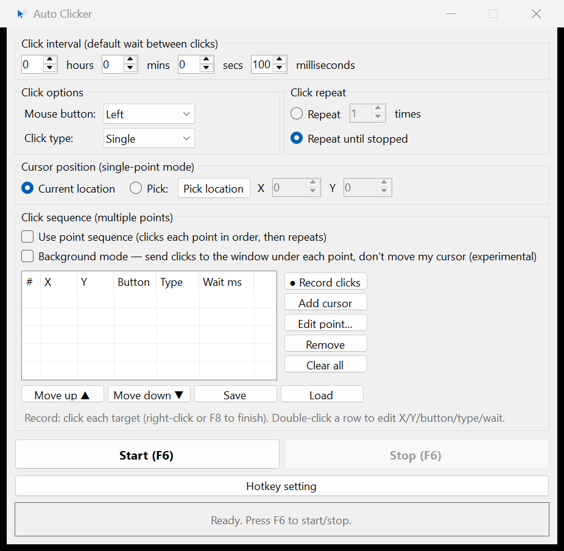

# Auto Clicker

A lightweight Windows mouse auto-clicker (C# / WinForms, .NET 10). Click or hold at a
fixed point, or run a recorded **sequence of points** with per-point waits.



## Features

- **Click / Double-click / Hold** with any mouse button (left / right / middle)
- Adjustable interval (hours / mins / secs / ms), accurate to ~1 ms
- Repeat **N times** or **until stopped**
- **Single point** (current cursor or a picked X/Y) **or multi-action sequences**
- Sequences aren't clicks-only — each step can be a **click, drag, scroll,
  key combo, typed text or plain wait**
- **Record by clicking** — hit *Record*, click each target, right-click or **F8** to finish
- Per-step **edit** and reorder
- **Window anchoring** — anchor a point to the window it was recorded in and it's
  stored as client coordinates, so the sequence survives that window being moved,
  resized or reopened
- **Humanize** — randomise position by ±N px and timing by ±N %, so the input
  isn't metronomically identical
- **Save / load** sequences as `.acseq` (JSON) for reuse. Files written by earlier
  versions still load.
- **Background mode** (experimental) — posts input to the window under each point
  without moving your real cursor, so you can keep working on another monitor
  *(target-dependent — see notes below)*
- Global **F6** start/stop hotkey (rebindable F1–F12); tells you if the key is
  already claimed by another app
- **Esc panic stop** — aborts the run and force-releases every mouse button, in case
  a hold or drag left one down. Esc is only claimed while a run is active, so it
  stays usable everywhere else.
- **Start delay** — count down N seconds before the run begins, so you can focus the
  target window first
- **Settings persist** between launches in `%AppData%\AutoClicker\settings.json`,
  including the last sequence you saved or loaded
- High-DPI aware, negative (multi-monitor) coordinates supported, custom icon,
  single self-contained build

## Action types

| Action | What it does |
|---|---|
| **Click** | Press a button at a point. Single or double, with an optional hold time. |
| **Drag** | Press at one point, travel to another over a set duration, release. |
| **Scroll** | Wheel notches at a point, vertical or horizontal. |
| **Key press** | A combo such as `Ctrl+C`, `Alt+Tab`, `Shift+F5`, `Enter`, `Esc`. |
| **Type text** | Literal text, sent as Unicode — the keyboard layout doesn't matter. |
| **Wait** | Nothing but the delay. Useful for letting a target catch up. |
| **Wait for pixel** | Block until a screen pixel matches (or stops matching) a colour, with an optional timeout. |

## Pixel conditions

Any action can be gated on the colour of a screen pixel, which is what turns a blind
repeater into something reactive:

- **Gate** — "only click if the pixel at (400,300) is `#1E90FF`", or *only if it isn't*.
  A gated-off action is skipped but still honours its wait, so a mostly-skipped
  sequence doesn't spin the CPU. Skipped rows are tinted grey-blue in the list.
- **Wait for pixel** — block until the pixel matches, then carry on. Optionally give up
  after N ms, and optionally stop the whole run when it does.

Pick the point and its colour together with **Pick pixel (3s)** — hover the thing you
care about and both the coordinates and the colour are captured. **Tolerance** is the
maximum per-channel difference that still counts as a match (0 = exact).

Pixel coordinates are always screen coordinates and are never window-anchored.

## Install

Download `AutoClicker.msix` from the [latest release](../../releases/latest) and
double-click it. The package is signed with a trusted CA code-signing certificate,
so there's no trust prompt or SmartScreen block.

Or via PowerShell:

```powershell
Add-AppxPackage -Path AutoClicker.msix
```

## Background mode — what works

Background mode uses `PostMessage` to the window under each point. It works for many
classic Win32 apps but **fails** on:

- Games using DirectInput / raw input (`WM_INPUT`)
- Chrome / Electron (events flagged `isTrusted: false`)
- UWP / WinUI / WPF (single window handle, internal hit-testing)
- Admin-elevated targets (blocked by UIPI)

For those, use normal (foreground) mode, which moves the cursor.

Keyboard actions in background mode are posted to the window of the most recent
positioned action in the sequence, and are the least reliable part of it —
synthesised `WM_KEY*` messages are ignored by most modern frameworks.

## Build

```powershell
dotnet build -c Release
dotnet run            # or launch bin\Release\net10.0-windows\AutoClicker.exe
```

## Package (MSIX)

```powershell
pwsh -File packaging\Build-Package.ps1
```

Publishes self-contained `win-x64`, packs an MSIX, and signs it. Edit
`$signThumbprint` in the script and the `Publisher` in `packaging\AppxManifest.xml`
to match your own code-signing certificate (they must be identical). Clear
`$signThumbprint` to fall back to a generated self-signed cert.

## License

MIT — see [LICENSE](LICENSE).
